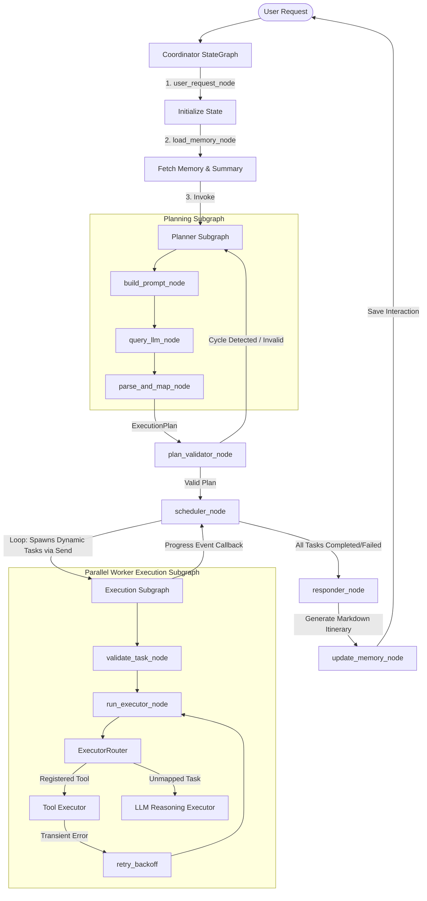

# 🌍 AI Travel Agent (travel-ai)

An autonomous, multi-agent, concurrent travel planning assistant built in Python using **LangGraph**. The application converts user travel goals (destinations, budgets, and constraints) into a dependency-aware task graph (DAG), executes it concurrently with robust resilience patterns, and generates comprehensive itineraries with real-time flight, weather, hotel, route, and currency exchange data.

---

## 📋 Table of Contents
1. [Architecture Overview & System Flow](#-architecture-overview--system-flow)
2. [Deep Dive: LangGraph State Graph & Subgraphs](#-deep-dive-langgraph-state-graph--subgraphs)
   - [Coordinator Graph State Schema](#1-coordinator-graph-state-schema)
   - [Coordinator Node Pipeline](#2-coordinator-node-pipeline)
   - [Planning Subgraph (`planner_subgraph`)](#3-planning-subgraph-planner_subgraph)
   - [Execution Subgraph (`execute_task_subgraph`)](#4-execution-subgraph-execute_task_subgraph)
   - [State Persistence & Checkpointing](#5-state-persistence--checkpointing)
3. [DAG Scheduling & Concurrency Engine](#-dag-scheduling--concurrency-engine)
   - [Dynamic Concurrency via `Send()`](#1-dynamic-concurrency-via-send)
   - [DFS Pre-Execution Cycle Detection](#2-dfs-pre-execution-cycle-detection)
   - [Sequential Task ID & Version Lineage](#3-sequential-task-id--version-lineage)
4. [Resilience & Network Fault-Tolerance](#-resilience--network-fault-tolerance)
   - [Selective Exception Classification](#1-selective-exception-classification)
   - [Exponential Backoff with Jitter](#2-exponential-backoff-with-jitter)
   - [Recursive Failure Cascade](#3-recursive-failure-cascade)
5. [Tool Registry & LLM Fallback Executor](#-tool-registry--llm-fallback-executor)
   - [Integrated External Tools](#1-integrated-external-tools)
   - [LLM Fallback Reasoning (`LLMExecutor`)](#2-llm-fallback-reasoning-llmexecutor)
   - [Token Optimization Strategy](#3-token-optimization-strategy)
6. [Configuration & Role-Based Temperature Policy](#-configuration--role-based-temperature-policy)
7. [Codebase Directory Structure](#-codebase-directory-structure)
8. [Setup, Installation & Execution](#-setup-installation--execution)

---

## 🏗️ Architecture Overview & System Flow

The system employs a hierarchically structured multi-agent workflow orchestrated entirely via **LangGraph**. User requests are ingested, enriched with sliding memory context, transformed into an executable Directed Acyclic Graph (DAG) of tasks, executed concurrently across isolated subgraphs, and compiled into a structured response.

### System Data Flow Diagram



---

## 🧠 Deep Dive: LangGraph State Graph & Subgraphs

### 1. Coordinator Graph State Schema

The central state for the Coordinator graph is defined as a `TypedDict` in `app/agents/graph_state.py`:

```python
class TravelAgentState(TypedDict):
    user_request: str
    conversation_memory: MemoryContext
    planner_context: PlannerContext
    metadata_context: MetadataContext
    execution_plan: ExecutionPlan
    final_response: str
    validation_result: ValidationResult
    scheduler_result: SchedulerResult
```

* **`user_request`**: The raw text prompt submitted by the user.
* **`conversation_memory`**: Stores message history and sliding window summary context.
* **`planner_context`**: Tracks replan iteration counts, user goal snapshots, and failure feedback.
* **`execution_plan`**: Authoritative container holding all `Task` objects, dependency maps, version lineage, and global execution status.
* **`validation_result`**: Status output of cycle checks, empty plan checks, and invalid DAG detection.
* **`scheduler_result`**: Tracks runnable tasks, running tasks, completed task counts, and failure status.

---

### 2. Coordinator Node Pipeline

The Coordinator graph (`CoordinatorAgent` in `app/agents/coordinator_agent.py`) connects nodes in a precise flow:

1. **`user_request_node`**: Normalizes user input and initializes session metadata.
2. **`load_memory_node`**: Retrieves past conversation turns and injects sliding summary context.
3. **`planner_subgraph`**: Invokes the planning pipeline subgraph to convert user input into an `ExecutionPlan`.
4. **`plan_validator_node`**: Runs DFS cycle detection and validates task dependencies.
   - *Conditional Edge (`route_after_validator`)*: If validation fails (e.g. cycle detected), routes back to `planner_subgraph` with error feedback. If valid, routes to `scheduler_node`.
5. **`scheduler_node`**: Evaluates runnable tasks based on parent dependency completion.
   - *Conditional Edge (`route_after_scheduler`)*:
     - Returns `Send("execute_task", ...)` for each ready task to launch parallel worker subgraphs.
     - Routes to `responder_node` when all tasks are finished or max retries are exhausted.
6. **`responder_node`**: Invokes `ResponseAgent` to compile raw task outputs into a comprehensive Markdown travel itinerary.
7. **`update_memory_node`**: Persists the user prompt and agent response into conversation memory.

---

### 3. Planning Subgraph (`planner_subgraph`)

The planning phase is encapsulated in an isolated subgraph in `app/agents/planner_subgraph.py`:

* **`build_prompt_node`**: Formats the system prompt using `PLANNER_SYSTEM_PROMPT` or `REPLANNER_SYSTEM_PROMPT`, injecting temporal context (current date/time) and available tool signatures.
* **`query_llm_node`**: Calls the LLM using:
  * `temperature = 0.0` (`PLANNER_TEMPERATURE` in `app/config.py`)
  * `response_format = {"type": "json_object"}` (Enforced JSON mode)
  * Dynamic schema injection: Injects `PlannerResponse.model_json_schema()` directly into prompt text to guarantee deterministic structure.
* **`parse_and_map_node`**: Validates raw JSON output against `PlannerResponse` Pydantic model. Converts valid models into internal `Task` objects, calculates sequential IDs (`max_existing_id + i + 1`), tracks version lineage (`version + 1`), and outputs the `ExecutionPlan`.

---

### 4. Execution Subgraph (`execute_task_subgraph`)

Individual tasks are executed in parallel isolated subgraphs (`app/agents/execution_subgraph.py`):

```text
[validate_task] ──> [run_executor] ──(Error & Retryable?)──> [retry_backoff] ──┐
                         │                                                   │
                         └──(Success / Permanent Error)──────────────────────┴──> (END)
```

* **`validate_task_node`**: Verifies task readiness and sets state to `RUNNING`.
* **`run_executor_node`**: Routes execution through `ExecutorRouter`:
  * **Tool Execution**: Matches `task.tool_name` against `AVAILABLE_TOOLS` in `app/registry/tool_registry.py`. Calls real API wrappers.
  * **LLM Fallback Execution**: Unmapped tasks are routed to `LLMExecutor` (`app/registry/llm_executor.py`) with `temperature = 0.0`.
* **`retry_backoff` Node**: If execution fails with a retryable exception (`httpx.RequestError`, HTTP 5xx, HTTP 429) and attempts remain, computes exponential delay with jitter, sleeps, and loops directly back to `run_executor_node`.

---

### 5. State Persistence & Checkpointing

`CoordinatorAgent` integrates `MemoryCheckpointProvider` (`app/agents/checkpoint_provider.py`), wrapping LangGraph's `MemorySaver`. This enables:
* In-memory state persistence across multi-turn user interactions.
* Thread-level isolation (`thread_id="session-default"`).
* Full replayability and debugging inspection of historical graph states.

---

## ⚡ DAG Scheduling & Concurrency Engine

### 1. Dynamic Concurrency via `Send()`

Instead of blocking on main thread execution, the scheduler node dynamically yields `Send("execute_task", {"task_id": id, "task": task_obj})` objects for every ready task (where all `depends_on` parent tasks are `COMPLETED`).

LangGraph concurrently dispatches these worker tasks in parallel threads inside a `ThreadPoolExecutor` (max 10 workers).

---

### 2. DFS Pre-Execution Cycle Detection

Before any task executes, `plan_validator_node` inspects the DAG for circular dependencies using Depth-First Search (DFS) recursion:

```python
def _has_cycle(task_id: int, visited: set, rec_stack: set, tasks: dict) -> bool:
    visited.add(task_id)
    rec_stack.add(task_id)
    
    for dep in tasks[task_id].depends_on:
        if dep in tasks:
            if dep not in visited:
                if _has_cycle(dep, visited, rec_stack, tasks):
                    return True
            elif dep in rec_stack:
                return True # Circular dependency detected!
                
    rec_stack.remove(task_id)
    return False
```

If a cycle is detected (e.g. Task 1 → Task 2 → Task 1), the validator marks `valid=False` and sends error feedback back to `planner_subgraph` to regenerate the plan.

---

### 3. Sequential Task ID & Version Lineage

When replanning or expanding execution plans:
* New task IDs start strictly after the maximum existing task ID (`max(existing_ids) + 1`).
* Plan version increments monotonically (`version = version + 1`).
* Task dependencies are re-mapped to ensure consistent reference integrity.

---

## 🛡️ Resilience & Network Fault-Tolerance

### 1. Selective Exception Classification

The resilience engine in `app/agents/retry_policy.py` classifies exceptions into retryable and non-retryable categories:

| Exception Type | Classification | Action |
| :--- | :--- | :--- |
| `httpx.RequestError` | **Retryable** | Trigger `retry_backoff` node |
| HTTP `500`, `502`, `503`, `504` | **Retryable** | Trigger `retry_backoff` node |
| HTTP `429` (Rate Limited) | **Retryable** | Trigger `retry_backoff` node |
| HTTP `400`, `401`, `403`, `404` | **Permanent** | Fail immediately, skip retries |
| Pydantic `ValidationError` | **Permanent** | Fail immediately |
| Key / Value / Type Errors | **Permanent** | Fail immediately |

---

### 2. Exponential Backoff with Jitter

Retry delays are computed dynamically:

$$\text{Delay} = (\text{base\_delay} \times 2^{\text{attempt}}) + \text{uniform}(0.1, 0.5)$$

* `base_delay`: Default `1.0s`
* `max_delay`: Capped at `10.0s`
* `jitter`: Adds random float offset between `0.1s` and `0.5s` to prevent thundering herd collisions against rate-limited API servers.

---

### 3. Recursive Failure Cascade

When a task fails permanently (exhausted retries or non-retryable error), `_propagate_failure` recursively marks all downstream dependent tasks as `FAILED`:

```python
# Downstream tasks depending on the failed task are recursively marked failed
task.status = TaskStatus.FAILED
task.error = f"Dependency failure: Parent task {failed_id} failed."
```

---

## 🛠️ Tool Registry & LLM Fallback Executor

### 1. Integrated External Tools

All tools are built using LangChain's native `@tool` decorator in `app/tools/` and registered into `LANGCHAIN_TOOLS` in `app/registry/tool_registry.py`:

| Tool Name | Tool File | Description | Provider |
| :--- | :--- | :--- | :--- |
| `search_flights` | `app/tools/flights.py` | Fetches real-time flight schedules between airports | AviationStack API |
| `get_current_weather` | `app/tools/weather.py` | Queries real-time weather forecasts & temperatures | WeatherAPI.com |
| `search_places` | `app/tools/places.py` | Finds tourist attractions, monuments, & sights | Geoapify Places |
| `search_hotels` | `app/tools/hotels.py` | Searches accommodations & hotels by location | Geoapify Places |
| `get_route` | `app/tools/maps.py` | Calculates driving routes, distances, & travel time | Geoapify Routing |
| `convert_currency` | `app/tools/currency.py` | Converts currency exchange rates (e.g. USD to INR) | Frankfurter API |

---

### 2. LLM Fallback Reasoning (`LLMExecutor`)

Tasks that require logical reasoning, custom itinerary synthesis, or general knowledge (without a matching API tool) are routed to `LLMExecutor` (`app/registry/llm_executor.py`).
* Temperature is locked to `0.0`.
* Ingests full `user_request` and task arguments to generate grounded task responses.

---

### 3. Token Optimization Strategy

To minimize LLM token overhead when calling `ResponseAgent`:
* `ResponseAgent._build_execution_summary()` strips all `None`, empty, or default fields from task outputs.
* Passes only essential keys: `tool`, `description`, `result`, and `error`.
* Reduces prompt token usage by ~40-60% per request.

---

## ⚙️ Configuration & Role-Based Temperature Policy

System configuration parameters are defined in `app/config.py`:

```python
# LLM Role Temperatures
PLANNER_TEMPERATURE = 0.0   # Deterministic JSON DAG planning
RESPONSE_TEMPERATURE = 0.7  # Creative, engaging user chat response

# Execution Parameters
MAX_WORKERS = 10            # ThreadPoolExecutor concurrency limit
MAX_RETRIES = 3             # Maximum transient task retry attempts
BASE_RETRY_DELAY = 1.0      # Base exponential backoff delay in seconds
MAX_RETRY_DELAY = 10.0      # Cap on backoff delay
```

---

## 📁 Codebase Directory Structure

```text
travel-ai/
│
├── app/
│   ├── agents/                   # LangGraph StateGraph, subgraphs, nodes & state
│   │   ├── __init__.py           # Package exports (CoordinatorAgent, ResponseAgent)
│   │   ├── checkpoint_provider.py # Thread state checkpointer (MemorySaver)
│   │   ├── coordinator_agent.py  # Main Coordinator StateGraph definition
│   │   ├── execution_subgraph.py # Worker execution subgraph with retry backoff loop
│   │   ├── executor_router.py    # Routes task execution to ToolExecutor or LLMExecutor
│   │   ├── graph_nodes.py        # Coordinator nodes (request, memory, validator, scheduler)
│   │   ├── graph_state.py        # LangGraph state TypedDicts & Pydantic models
│   │   ├── planner_subgraph.py   # Planning pipeline subgraph (build, query, parse)
│   │   ├── response_agent.py     # Markdown itinerary response compiler
│   │   └── retry_policy.py       # Exponential backoff and exception classification
│   │
│   ├── memory/                   # Conversation log storage and sliding summary memory
│   │   ├── __init__.py
│   │   └── conversation_memory.py
│   │
│   ├── prompts/                  # Prompt definitions and JSON schemas
│   │   ├── __init__.py
│   │   ├── execution_prompt.py
│   │   ├── planner_prompt.py
│   │   └── response_prompt.py
│   │
│   ├── registry/                 # Tool executor mapping & LLM fallback
│   │   ├── __init__.py
│   │   ├── llm_executor.py
│   │   ├── tool_executor.py
│   │   └── tool_registry.py
│   │
│   ├── schemas/                  # Pydantic data validation models
│   │   ├── api/                  # External API response validation models
│   │   │   ├── response_models.py
│   │   │   └── trip.py
│   │   └── planner/              # Task, plan & policy models
│   │       ├── execution_plan.py
│   │       ├── plan.py
│   │       ├── planner_response.py
│   │       ├── planner_task.py
│   │       ├── policy.py
│   │       └── task.py
│   │
│   ├── services/                 # Raw HTTP service clients for external APIs
│   │   ├── currency_service.py
│   │   ├── flight_service.py
│   │   ├── geocoding_service.py
│   │   ├── maps_service.py
│   │   ├── places_service.py
│   │   └── weather_service.py
│   │
│   ├── tools/                    # Registered tool wrappers around services
│   │   ├── currency.py
│   │   ├── flights.py
│   │   ├── hotels.py
│   │   ├── maps.py
│   │   ├── places.py
│   │   └── weather.py
│   │
│   ├── config.py                 # Environment & temperature configurations
│   ├── utils.py                  # Serialization & logging utility helpers
│   └── llm/                      # LLM Client wrapper (Groq integration)
│       └── client.py
│
├── README.md                     # Comprehensive project documentation
├── main.py                       # Application interactive CLI entrypoint
├── pyproject.toml                # Project configurations & dependencies
└── uv.lock                       # Lockfile mapping exact dependency resolutions
```

---

## 🚀 Setup, Installation & Execution

### 1. Configure Environment Variables
Copy `.env.example` to `.env` in the project root:
```bash
cp .env.example .env
```

Fill in your API keys in `.env`:
```ini
GROQ_API_KEY=your_groq_api_key_here
WEATHER_API_KEY=your_weather_api_key_here
GEOAPIFY_API_KEY=your_geoapify_api_key_here
AVIATIONSTACK_API_KEY=your_aviationstack_api_key_here
```

### 2. Install Dependencies
Using `uv`:
```bash
uv sync
```

Or using standard `pip` inside your virtual environment:
```powershell
.venv\Scripts\activate
pip install -r pyproject.toml
```

### 3. Run the Interactive Application
Launch the console application:
```bash
uv run main.py
```
Or directly:
```bash
python main.py
```

### 4. Sample Prompt & Console Output
```text
You: Create a 5-day budget-friendly tour plan for Bengaluru starting from Kolkata.

--- Planner/Executor Progress ---
[ProgressEvent] Task 1 [Worker Thread 1]: "Search flights from Kolkata to Bengaluru" -> RUNNING
[ProgressEvent] Task 2 [Worker Thread 2]: "Get weather forecast for Bengaluru" -> RUNNING
[ProgressEvent] Task 2 [Worker Thread 2]: "Get weather forecast for Bengaluru" -> COMPLETED (0.85s)
[ProgressEvent] Task 1 [Worker Thread 1]: "Search flights from Kolkata to Bengaluru" -> COMPLETED (1.42s)
[ProgressEvent] Task 3 [Worker Thread 3]: "Search tourist attractions in Bengaluru" -> RUNNING
[ProgressEvent] Task 3 [Worker Thread 3]: "Search tourist attractions in Bengaluru" -> COMPLETED (2.10s)
[ProgressEvent] Task 4 [Worker Thread 4]: "Draft 5-day itinerary" -> RUNNING
[ProgressEvent] Task 4 [Worker Thread 4]: "Draft 5-day itinerary" -> COMPLETED (1.90s)

--- Final Response ---
## 5-Day Bengaluru Itinerary (Budget Trip from Kolkata)

### Flight Options (Kolkata -> Bengaluru)
...
```
