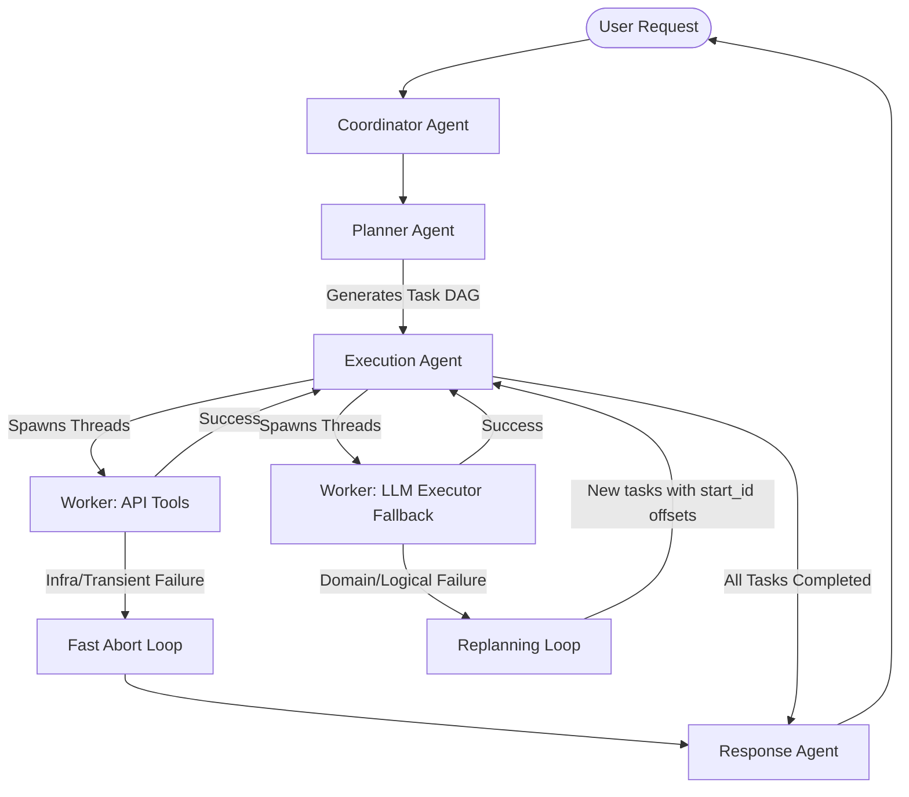

# 🌍 AI Travel Agent (travel-ai)

An autonomous, multi-agent, concurrent travel planning assistant built in Python. The application converts user travel goals (destinations, budgets, and constraints) into a dependency-aware task graph (DAG), executes it concurrently with robust resilience patterns, and generates comprehensive itineraries with real-time flight, weather, hotel, and route data.

---

## 📌 Core Features & Capabilities

### 1. Multi-Agent Collaborative System
* **Coordinator Agent (`CoordinatorAgent`)**: Directs the high-level workflow, manages memory, tracks global state, and initiates replanning runs on task failure.
* **Planner Agent (`PlannerAgent`)**: Deconstructs user goals into logical steps. Generates tasks with explicit parameters, priority rankings, and dependency mapping.
* **Execution Agent (`ExecutionAgent`)**: Orchestrates concurrent thread execution of tasks, respects parent-child constraints, and propagates failures.
* **Response Agent (`ResponseAgent`)**: Combines execution results, logs, and itineraries to compile a final travel package for the user.

### 2. DAG Scheduling & Concurrency Engine
* **Concurrent Execution**: Spawns worker threads inside a `ThreadPoolExecutor` (max 10 workers) to query multiple APIs simultaneously.
* **Dependency Resolution**: Pending tasks are scheduled dynamically *only* when all parent tasks listed in `depends_on` are successfully completed.
* **Pre-Execution Cycle Detection**: Traverses the task network using Depth-First Search (DFS) prior to running. If a circular dependency is found (e.g. Task A → Task B → Task A), it aborts instantly to prevent deadlocks.
* **Thread-Safe Memory Locks**: Protects concurrent reads and writes to shared execution plan variables using a mutex `threading.Lock()`.
* **Stable Worker IDs**: Assigns incrementing, unique worker ID indexes (`1` through `N`) to tasks at launch time under thread lock.

### 3. Resilience & Network Fault-Tolerance
* **Selective Transient Retries**: Automatically catches transient exceptions (`httpx.RequestError`, server-side `5xx`, and rate limits `429`). Retries are scheduled up to `max_retries` (default 3). Permanent client errors (e.g., `400 Bad Request`, `401 Unauthorized`, validation errors) fail immediately.
* **Exponential Backoff with Jitter**: Doubles wait times between retries ($delay \times 2^{attempt}$) and adds a random float offset (jitter of `0.1s` - `0.5s`) to prevent thundering herd collisions against rate-limited API servers.
* **Recursive Failure Propagation**: If a parent task fails, a recursive cascade (`_propagate_failure`) runs immediately, marking all downstream dependent tasks as `FAILED` with a dependency error type.
* **Infrastructure Fast-Abort**: If a task fails because of an infrastructure error (exhausted transient retries), the coordinator terminates immediately instead of replanning, saving LLM budget.

### 4. API Safety & Validation Layer
* **Pydantic Validation**: All external API payloads are validated using schemas in `response_models.py` (Geoapify, AviationStack, WeatherAPI, Frankfurter Currency) to prevent runtime crashes caused by raw dictionary indexing (`data["key"]`).
* **Temporal Context Injection**: The current local date and time are dynamically injected into prompt systems, aligning planning decisions with today's date.
* **Flight Date Filtering**: Filters out yesterday's flights during general API queries, preserving historical query capability only when the user specifies a past date.
* **LLM Fallback Executor (`LLMExecutor`)**: Unmapped API tasks (e.g. general travel questions or itinerary drafting) are routed to a dedicated LLM reasoning prompt.

---

## 🏗️ Architecture & Data Flow



---

## 📁 Codebase Directory Layout

```text
travel-ai/
│
├── app/
│   ├── agents/                   # Coordinator, Execution, Planner, and Response Agents
│   │   ├── coordinator_agent.py
│   │   ├── execution_agent.py
│   │   ├── planner_agent.py
│   │   └── response_agent.py
│   │
│   ├── memory/                   # Conversation logs and sliding summary memory
│   │   └── conversation_memory.py
│   │
│   ├── planner/                  # Task graph build tools and validator
│   │   └── planner.py
│   │
│   ├── prompts/                  # LLM Prompt definitions and templates
│   │   ├── execution_prompt.py
│   │   ├── planner_prompt.py
│   │   └── response_prompt.py
│   │
│   ├── registry/                 # Tool executor mapping and LLM reasoning fallback
│   │   ├── llm_executor.py
│   │   ├── tool_executor.py
│   │   └── tool_registry.py
│   │
│   ├── schemas/                  # Pydantic models for API responses and task structures
│   │   ├── api/
│   │   │   ├── response_models.py
│   │   │   └── trip.py
│   │   └── planner/
│   │       ├── plan.py
│   │       └── task.py
│   │
│   ├── services/                 # External API client layers
│   │   ├── currency_service.py
│   │   ├── flight_service.py
│   │   ├── geocoding_service.py
│   │   ├── maps_service.py
│   │   ├── places_service.py
│   │   └── weather_service.py
│   │
│   ├── tools/                    # Tool wrappers for services
│   │   ├── currency.py
│   │   ├── flights.py
│   │   ├── hotels.py
│   │   ├── maps.py
│   │   ├── places.py
│   │   └── weather.py
│   │
│   ├── config.py                 # Configuration loader
│   └── llm/                      # LLM Client wrapper for Groq
│       └── client.py
│
├── README.md                     # Project Status & Documentation (this file)
├── main.py                       # Application interactive CLI entrypoint
├── pyproject.toml                # Project configurations & dependency declarations
└── uv.lock                       # Lockfile mapping exact dependency resolutions
```

---

## ⚙️ Setup & Execution

### 1. Configure the environment variables
Copy `.env.example` to `.env` in the root folder:
```bash
cp .env.example .env
```
Fill in the API keys in your new `.env` file:
* `GROQ_API_KEY`: API key for accessing LLM inference.
* `WEATHER_API_KEY`: API key from WeatherAPI.com.
* `GEOAPIFY_API_KEY`: Geoapify API key for hotels, maps routes, and geocoding.
* `AVIATIONSTACK_API_KEY`: AviationStack API key for flight schedules.

### 2. Install dependencies
The project uses the `uv` tool manager to align dependencies:
```bash
uv sync
```
Or use pip inside the virtual environment:
```powershell
.venv\Scripts\activate
pip install -r pyproject.toml
```

### 3. Run the application
Run the interactive console script:
```bash
uv run main.py
```
Type travel queries like:
> "Give me a budget friendly trip plan for Goa. My hometown is Kolkata and budget is 30000."
