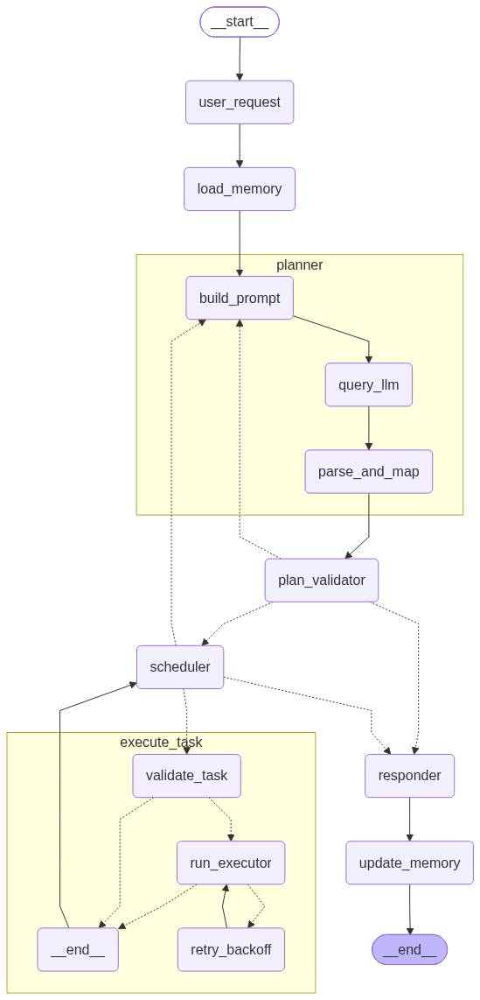
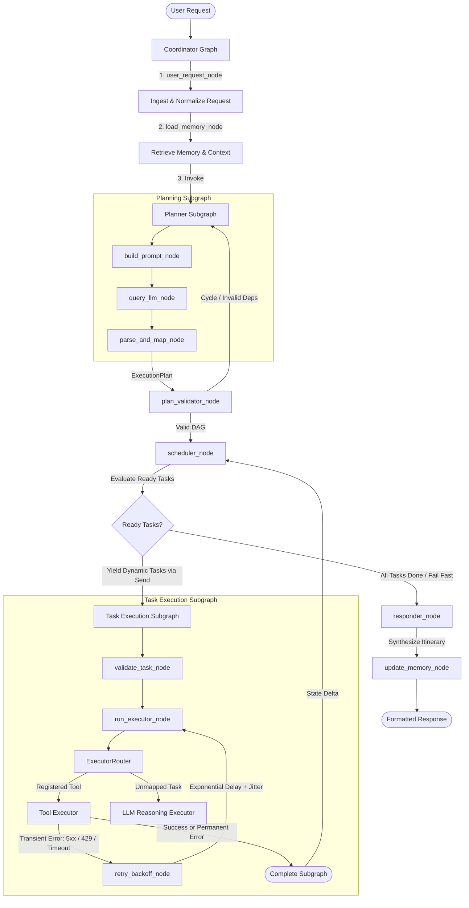

# 🌍 AI Travel Agent (`travel-ai`)

> Production-oriented AI travel agent with LangGraph orchestration, DAG-based planning, concurrent task execution, fault-tolerant API integrations, and LLM fallback reasoning.

[](https://www.python.org/)
[](https://github.com/langchain-ai/langgraph)
[](https://docs.pydantic.dev/)
[](#-testing)

```text
User Request
    ↓
Coordinator (LangGraph)
    ↓
Planner (DAG Generation)
    ↓
DAG Validator (DFS Cycle Detection)
    ↓
Dependency Scheduler
    ↓
Parallel Execution (Dynamic Send)
    ↓
Resilience Engine (Retry / Backoff / Cascades)
    ↓
State Reconciliation
    ↓
Responder (Itinerary Synthesis)
```

---


## 💡 Why This Project?

Building reliable LLM agents for complex, multi-step real-world tasks (like travel itinerary generation) reveals core software engineering challenges that single-prompt chatbots cannot solve:

1. **Non-deterministic Planning**: LLMs hallucinate dependencies, repeat completed work, or create circular prerequisite loops if left unconstrained.
2. **Sequential Bottlenecks**: Independent tasks (fetching weather, searching flights, discovering hotels, checking exchange rates) block execution if executed serially.
3. **Network & API Volatility**: Real-world external APIs experience rate limits (HTTP 429), transient server hiccups (HTTP 5xx), and network timeouts that require resilient retry policies with backoff and jitter.
4. **Cascading Failure Modes**: If an essential prerequisite fails (e.g. flight lookup fails permanently), downstream dependent tasks (e.g. hotel booking matching arrival time) must be cleanly failed or replanned without deadlocking the execution engine.

This project addresses these challenges by combining **LangGraph** orchestration, **DAG-based task decomposition**, **dynamic `Send()` concurrency**, **Pydantic v2 validation**, **typed HTTP exception classification**, and **deterministic state reconciliation**.

---

## 🏗️ Architecture

The system coordinates a hierarchical LangGraph architecture composed of a root **Coordinator Graph** and two dedicated subgraphs: **Planning Subgraph** and **Task Execution Subgraph**.

<p align="center">
  
</p>



---

## ⚡ Key Engineering Features

- **DAG-Based Task Planning**: Decomposes user goals into an executable Directed Acyclic Graph with explicit `depends_on` prerequisite relationships and execution priorities.
- **LangGraph Dynamic Concurrency via `Send()`**: Instead of executing tasks in a static linear chain, the scheduler dynamically dispatches ready tasks concurrently into parallel isolated execution subgraphs via LangGraph's native `Send()` API.
- **Pre-Execution DAG Validation**: Depth-First Search (DFS) detects circular dependencies ($O(V + E)$), catches self-referential tasks, verifies dependency target existence, and validates tool argument schemas before any task runs.
- **Resilience Engine with Exponential Backoff & Jitter**: Concrete exception classifier inspects HTTP status codes and transport errors:
  - **Retryable**: `httpx.TimeoutException`, `httpx.NetworkError`, HTTP `429` (Rate Limited), HTTP `500, 502, 503, 504`.
  - **Permanent**: HTTP `400, 401, 403, 404`, Pydantic `ValidationError`, `ValueError`, `KeyError`.
  - **Backoff Formula**: $\min(\text{max\_delay}, \text{base\_delay} \times 2^{\text{attempt}-1}) + \text{uniform}(\text{jitter\_min}, \text{jitter\_max})$.
- **Recursive Failure Cascades**: When a task encounters a permanent failure, the scheduler recursively identifies all downstream dependents and marks them `FAILED` with `failure_type="dependency"`, preventing blocked deadlocks.
- **Replanning & State Reconciliation**: When replanning occurs, previously executed task outputs and global IDs are preserved (`merged_tasks = {**execution_plan.tasks, **new_tasks}`), and new tasks receive sequential IDs starting from `max_existing_id + 1`.
- **Integrated Tool Registry**: Connects six external data sources wrapped in LangChain `@tool` interfaces with domain validation:
  - **Flights**: AviationStack API
  - **Weather**: WeatherAPI.com
  - **Places & Attractions**: Geoapify Places API
  - **Hotels**: Geoapify Accommodation API
  - **Routing & Maps**: Geoapify Routing API
  - **Currency**: Frankfurter Exchange Rates API
- **LLM Fallback Reasoning**: Any task without a matching external tool is routed to `LLMExecutor` via standard LangChain LCEL chains with `temperature = 0.0`.
- **State Checkpointing**: Memory checkpointer (`MemorySaver`) maintains session state, message history, and sliding window summaries across multi-turn interactions.

---

## 📋 Example Execution Flow

```text
User: Create a 5-day budget-friendly tour plan for Bengaluru starting from Kolkata.

--- Planner / Scheduler Progress ---
[ProgressEvent] Task 1 [Worker 1]: "Convert budget from INR to USD" -> RUNNING
[ProgressEvent] Task 2 [Worker 2]: "Search flights from CCU to BLR" -> RUNNING
[ProgressEvent] Task 3 [Worker 3]: "Get current weather for Bengaluru" -> RUNNING
[ProgressEvent] Task 1 [Worker 1]: "Convert budget from INR to USD" -> COMPLETED (0.24s)
[ProgressEvent] Task 3 [Worker 3]: "Get current weather for Bengaluru" -> COMPLETED (0.58s)
[ProgressEvent] Task 2 [Worker 2]: "Search flights from CCU to BLR" -> COMPLETED (1.12s)
[ProgressEvent] Task 4 [Worker 4]: "Search hotels in Bengaluru" -> RUNNING (depends on Task 1, 2)
[ProgressEvent] Task 4 [Worker 4]: "Search hotels in Bengaluru" -> COMPLETED (0.82s)
[ProgressEvent] Task 5 [Worker 5]: "Draft 5-day itinerary" -> RUNNING (LLM Reasoning Fallback)
[ProgressEvent] Task 5 [Worker 5]: "Draft 5-day itinerary" -> COMPLETED (1.45s)

--- Final Response ---
## 5-Day Bengaluru Itinerary
...
```

---

## 🛠️ Tech Stack

| Component | Technology | Purpose |
| :--- | :--- | :--- |
| **Language** | Python 3.11+ | Core runtime |
| **Orchestration** | LangGraph 1.2+ | StateGraph, subgraphs, dynamic `Send()` branching |
| **Framework** | LangChain 1.3+ | Tool binding, LCEL prompt templates, message history |
| **Validation** | Pydantic v2.13+ | Schema validation, type hints, serialization |
| **HTTP Client** | HTTPX 0.28+ | Synchronous and asynchronous REST API communication |
| **LLM Provider** | Groq (Llama-3.3-70b-versatile) | Deterministic planning (`temp=0.0`) & synthesis |
| **Package Manager**| `uv` | Fast dependency resolution, lockfile, and virtualenv |
| **Testing** | Pytest 9.1+, pytest-asyncio | Deterministic offline unit & integration test suite |

---

## 📁 Project Structure

```text
travel-ai/
├── app/
│   ├── agents/                   # LangGraph StateGraph, subgraphs, nodes & state
│   │   ├── checkpoint_provider.py # In-memory thread checkpointer (MemorySaver)
│   │   ├── coordinator_agent.py  # Main Coordinator StateGraph & edge routers
│   │   ├── execution_subgraph.py # Worker execution subgraph with retry backoff loop
│   │   ├── executor_router.py    # Routes tasks to ToolExecutor or LLMExecutor
│   │   ├── graph_nodes.py        # Core nodes: validator, scheduler, memory, responder
│   │   ├── graph_state.py        # State TypedDict, reducers (merge_plans, merge_tasks)
│   │   ├── planner_subgraph.py   # Planning pipeline subgraph (build, query, parse)
│   │   ├── response_agent.py     # Markdown itinerary response compiler
│   │   └── retry_policy.py       # Exponential backoff, jitter, and exception classifier
│   │
│   ├── core/                     # LLM client factory, config & embeddings
│   │   ├── config.py             # Strongly typed Settings model
│   │   ├── embeddings.py         # Embeddings client wrapper
│   │   └── llm.py                # LLM factory with provider fallbacks
│   │
│   ├── memory/                   # Conversation history & sliding summary memory
│   │   └── conversation_memory.py
│   │
│   ├── prompts/                  # System prompts & JSON schemas
│   │   ├── execution_prompt.py
│   │   ├── planner_prompt.py
│   │   └── response_prompt.py
│   │
│   ├── registry/                 # Tool executor mapping & LLM fallback
│   │   ├── llm_executor.py
│   │   ├── tool_executor.py
│   │   └── tool_registry.py
│   │
│   ├── schemas/                  # Pydantic data validation models
│   │   ├── api/                  # REST API response models
│   │   │   └── response_models.py
│   │   └── planner/              # Task, ExecutionPlan, ProgressEvent schemas
│   │       ├── execution_plan.py
│   │       ├── planner_response.py
│   │       ├── progress_event.py
│   │       └── task.py
│   │
│   ├── services/                 # External HTTP clients (AviationStack, Weather, Geoapify)
│   │   ├── currency_service.py
│   │   ├── flight_service.py
│   │   ├── geocoding_service.py
│   │   ├── maps_service.py
│   │   ├── places_service.py
│   │   └── weather_service.py
│   │
│   └── tools/                    # Registered LangChain @tool wrappers
│       ├── currency.py
│       ├── flights.py
│       ├── hotels.py
│       ├── maps.py
│       ├── places.py
│       └── weather.py
│
├── tests/                        # Deterministic offline unit & integration test suite
│   ├── conftest.py               # Reusable fixtures & mock objects
│   ├── test_dag_validation.py    # DFS cycle detection, self-deps, unknown tools
│   ├── test_resilience.py        # Exception classification, backoff calculation, retry loop
│   ├── test_scheduler.py         # Dependency waiting, parallel readiness, failure cascades
│   ├── test_state_reconciliation.py # State reducers, replanning task preservation
│   └── test_tools.py             # Tool registry, domain input validation, mock execution
│
├── main.py                       # Interactive CLI entrypoint
├── pyproject.toml                # Project configurations, dependencies & dev-tools
└── uv.lock                       # Cryptographically locked dependency resolutions
```

---

## 🚀 Quick Start

### 1. Prerequisites
- Python 3.11 or higher
- [`uv`](https://github.com/astral-sh/uv) (recommended) or standard `pip`

### 2. Installation
Clone the repository and install dependencies using `uv`:
```bash
git clone https://github.com/kishormaity/Travel_Agent.git
cd Travel_Agent/travel-ai
uv sync
```

### 3. Environment Configuration
Copy the example environment file:
```bash
cp .env.example .env
```

Configure your API keys in `.env`:
```ini
GROQ_API_KEY=your_groq_api_key_here
WEATHER_API_KEY=your_weatherapi_key_here
GEOAPIFY_API_KEY=your_geoapify_key_here
AVIATIONSTACK_API_KEY=your_aviationstack_key_here

MODEL_NAME=llama-3.3-70b-versatile
TEMPERATURE=0.7
MAX_TOKENS=1024
```

### 4. Running the Interactive CLI
Launch the terminal assistant:
```bash
uv run python main.py
```

---

## 🧪 Testing

The test suite is **100% deterministic, offline, and mock-driven**—no real API keys or external network requests are needed.

Execute the test suite with verbose output:
```bash
uv run pytest -v
```

### Test Coverage Focus Areas:
- **DAG Cycle Detection**: Validates DFS cycle detection algorithm on cyclic ($A \to B \to A$ and $A \to B \to C \to A$) and linear DAGs.
- **Structural Integrity**: Rejects self-dependencies ($A \to A$), non-existent dependency IDs, and unknown tools.
- **Dependency Scheduling**: Verifies that dependent tasks remain in `WAITING` until all parent tasks reach `COMPLETED`.
- **Concurrent Dispatch**: Confirms multiple independent tasks transition to `READY` simultaneously.
- **Failure Cascading**: Confirms permanent failures recursively propagate down the dependency tree as `FAILED` with `failure_type="dependency"`.
- **Resilience & Retry Classification**: Tests concrete HTTP status codes (transient 5xx/429 vs. permanent 4xx) and transport exceptions.
- **Backoff & Jitter**: Verifies exponential backoff scaling, jitter bounds, and maximum delay clamping.
- **State Reconciliation**: Validates that replanning preserves historical task results, assigns sequential IDs, and maintains version lineage.
- **Tool Domain Validation**: Validates handled domain errors (empty queries, invalid amounts) and mock tool execution.

---

## 📐 Detailed Architecture & Concurrency Model

### Dynamic Branch Execution via `Send()`
In standard workflow engines, concurrency is often bounded by static thread pools. In this system:
1. The **`scheduler_node`** analyzes task dependency states in the active `ExecutionPlan`.
2. All tasks whose parent prerequisites are satisfied are placed into `scheduler_result.ready_tasks`.
3. The conditional edge `route_after_scheduler` evaluates the result:
   ```python
   if scheduler_result.has_ready_tasks:
       return [Send("execute_task", {"task_id": t_id, "task": tasks[t_id]}) for t_id in scheduler_result.ready_tasks]
   ```
4. LangGraph dynamically spawns parallel execution paths for each `Send()` item.
5. As tasks complete or fail, their state deltas are collected and merged by the custom StateGraph reducer:
   ```python
   def merge_tasks(existing: dict[int, Task], updates: dict[int, Task]) -> dict[int, Task]:
       merged = dict(existing or {})
       for task_id, update_task in (updates or {}).items():
           if task_id in merged:
               merged[task_id] = merged[task_id].model_copy(update=update_task.model_dump(exclude_unset=True))
           else:
               merged[task_id] = update_task
       return merged
   ```
6. The graph loops back to `scheduler_node` until all branches have reconciled.

---

## ⚖️ Design Decisions & Trade-offs

1. **StateGraph Subgraphs vs. Single Flat Graph**:
   - *Decision*: Encapsulate the planning and worker execution pipelines into subgraphs (`planner_subgraph` and `execute_task_subgraph`).
   - *Rationale*: Isolates task-level retry backoff loops from graph-level replanning cycles, preventing graph state pollution.
2. **Deterministic Pre-Validation vs. In-Flight Failure**:
   - *Decision*: Validate DAG cycles and required tool arguments in `plan_validator_node` before dispatching workers.
   - *Rationale*: Catches hallucinated schemas and circular references before making external API calls, saving latency and API quotas.
3. **Structured Domain Results vs. Raised Exceptions**:
   - *Decision*: Handled business responses (e.g. empty search results) return `ToolResult(success=True/False)`. Transient infrastructure failures raise typed exceptions.
   - *Rationale*: Allows the execution subgraph's resilience engine to retry network glitches without pointlessly retrying valid but empty search queries.

---

## 🔮 Future Improvements

- **Distributed Task Queue**: Replace in-memory `Send()` dispatch with a Redis/Celery queue for multi-node worker distribution.
- **Persistent Checkpointer**: Replace `MemorySaver` with a PostgreSQL/PostgresSaver checkpointer for durable production sessions.
- **Streaming UI**: Implement server-sent events (SSE) to stream DAG progress events to a React/Next.js frontend.

